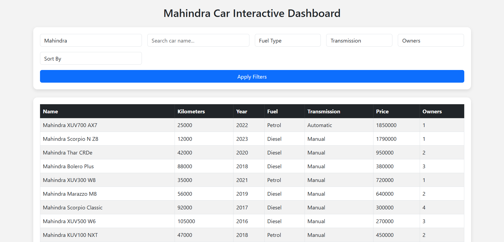

📌 Project Overview

This MINI PROJECT focuses on web scraping and data analysis using AckoDrive's used-car listings.

Since AckoDrive uses JavaScript-rendered pages + anti-bot protections, direct scraping was difficult.
Therefore, this project includes:

✔ Web scraping attempts (Requests, Selenium, JS analysis)
✔ Prepared datasets for:

Mahindra

Toyota

Kia

✔ A complete Flask interactive dashboard
✔ A detailed Jupyter Notebook with:

Scraping investigation

Data cleaning

Visualization

Brand comparison

📁 Project Structure
MINI PROJECT/
│
├── data/
│   ├── Mahindra_cars_collection_Mumbai.csv
│   ├── Toyota_cars_collection_Mumbai.csv
│   ├── Kia_cars_collection_Mumbai.csv
│
├── notebooks/
│   ├── Web_Scraping_MiniProject.ipynb
│   ├── Advanced_Web_Scraping_MiniProject.ipynb
│
├── src/
│   ├── app.py                # Flask Dashboard Backend
│   ├── generate_datasets.py  # Script for Toyota/Kia dataset creation
│   ├── templates/
│   │   └── index.html        # Dashboard UI
│
└── README.md

🚗 Car Details Extracted

Each dataset includes:

Kilometers Driven

Year of Manufacture

Fuel Type

Transmission

Price

Location

Number of Owners

Car Brand

Car Model

🎨 Dashboard UI Preview

📊 Dashboard Features
🔍 Filter Options

Fuel Type

Transmission

Number of Owners

Sort (Price, KM, Year)

Free-text search

Brand selector (Mahindra, Toyota, Kia)

📈 Visual Charts (Plotly Interactive)

Cars by Year

Fuel Type Distribution

Price vs KM Scatter

Brand Comparison Charts:

Average Price

Number of Cars

Fuel Mix (stacked bar)

🧪 Jupyter Notebook Deliverables

The notebook includes:

📘 Scraping Investigation

HTML analysis

JSON script extraction tests

Selenium automation trial

Why scraping fails (Cloudflare/JS blocking)

🧹 Data Cleaning

Removing inconsistencies

Standardizing columns

Handling null values

Converting data types

📊 Analysis

Per-brand insights

Visual charts

Comparison metrics

📁 Outputs

Cleaned CSVs

Combined dataset

Brand-level summary table

🛠 Tech Stack
🔹 Language

Python 3.x

🔹 Backend

Flask

🔹 Data Processing

Pandas

NumPy

🔹 Visualization

Plotly

Matplotlib

Seaborn

🔹 Tools

Jupyter Notebook

VS Code

Git & GitHub

🚀 How to Run the Dashboard
1️⃣ Install Dependencies
pip install flask pandas plotly

2️⃣ Start the App
cd src
python app.py

3️⃣ Open in Browser
http://127.0.0.1:5000/

🧬 Brand Comparison Preview

Replace with your chart screenshot later:

🔮 Future Enhancements

Add ML model to predict used car price

Add live scraping with Playwright stealth mode

Deploy the dashboard to Render / Vercel

Add user authentication for Premium features

👨‍💻 Author
Abin Binu

B.Tech AIML

EVOASTRA Internship Program

GitHub: your-github-username

📄 License

This project is intended for academic and internship evaluation use only.
